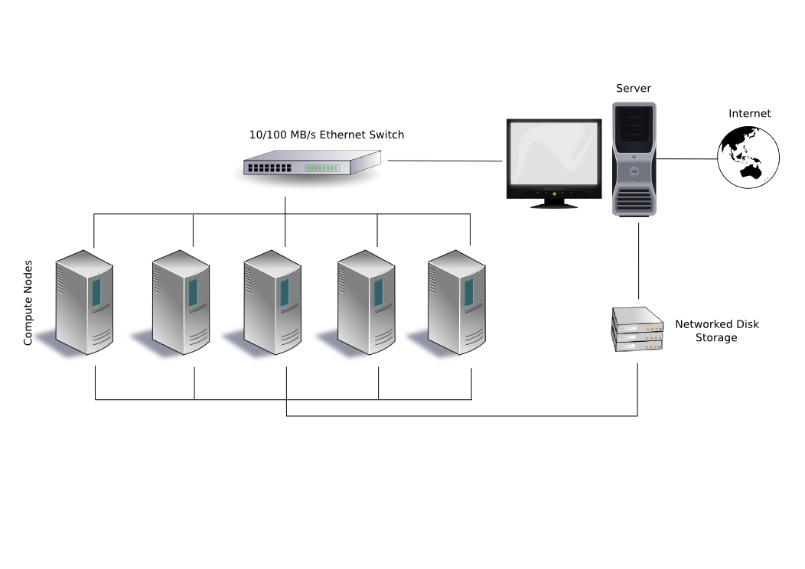

# What's an HPC cluster?

[*By Mukarramahmad (Own work) [Public domain], via Wikimedia Commons*](https://commons.wikimedia.org/wiki/File:Beowulf.png)

## Terminology

* Head Node
  * The server that connects a cluster to the an outside network.
* Compute Node
  * A server that is used for running computations, sometimes managed by a scheduler.
* Cores
  * A shorthand way to refer to the number of
  processor cores (usually physical) of a CPU
  in a node.

## Some Clusters At Princeton
For more detail, see:
[Computation Hardware @ Princeton](https://www.princeton.edu/researchcomputing/computational-hardware/)

### [Nobel](https://www.princeton.edu/researchcomputing/computational-hardware/nobel/)
  This cluster is most appropriate for interactive work. Any member of the
  university community can request access for their work. Two nodes (Davisson and Compton), no distinction between login/compute.

### [Adroit](https://www.princeton.edu/researchcomputing/computational-hardware/adroit/)
  Also available generally to members of the university community. 8 node Beowulf
  cluster. 2.5 Ghz Dell Ivybridge on 8 nodes with 20 cores. Scheduled job system.

### [McMillan](https://www.princeton.edu/researchcomputing/computational-hardware/experimental-systems/mcmillan/)
  Experimental cluster with access to GPUs. No data backups are made, and it is
  not connected to any of the major network storages. Intended for beginning
  or testing of new code for GPU applications.

### Other Clusters
  These other clusters such as Perseus, Hecate, Tiger, and Della are research
  clusters with many more nodes and networked storage between clusters.

  See [https://www.princeton.edu/researchcomputing/access/](https://www.princeton.edu/researchcomputing/access/)
  for details:

  >Access to the large clusters (Tiger, Della, Perseus and Hecate) is granted on the basis of proposals from faculty members directing the related research projects. After a proposal has been accepted, the faculty member need only send e-mail to cses@princeton.edu in order to add individual users.
